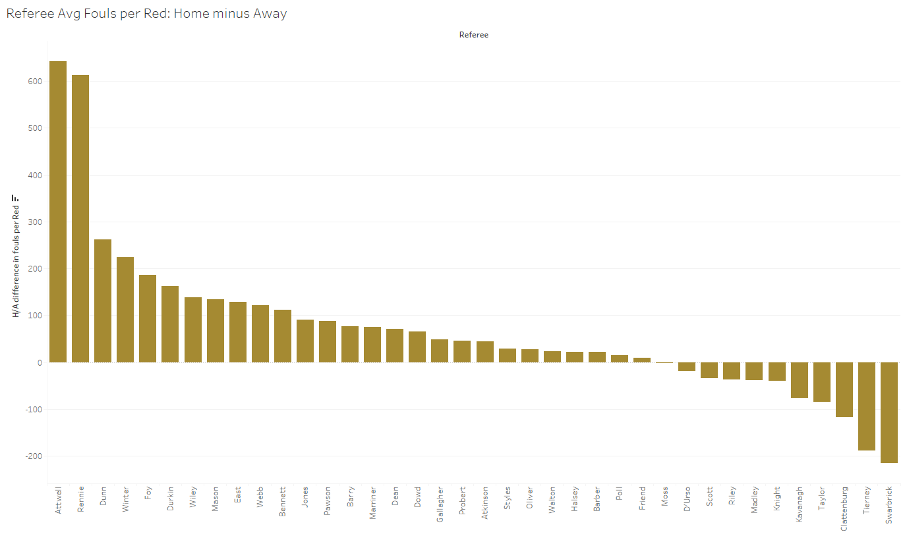

# Premier-League-Refereeing-Analysis
Analysis of Refereeing in 20 seasons of the Premier League - from 2000 to 2021. The tool used for data visualization is Tableau

## Introduction

Have you ever wondered if referees are influenced by the belligerent crowds of stadium? I would be surprised if you haven't. You just need to watch a Premier League game live in the stadium to see the level of pressure referees receive from crowds.

Have you ever felt that some teams are given less fouls, or must do less to receive a yellow or red card? Probably. That's just one day in the life of a biased football fan.

But have you ever seen any data that confirmed your intuition? I imagine not as these are simply heuristics we've built over longer periods, from experience of watching many games.

Well today, we're going to dive deeper in the data, and hopefully we can confirm our intuition...or not.

### A word on the data

In this analysis I processed data from the 2000-2001 season to the 2020-2021, inclusive. Football data is absolutely a nightmare to find, and if you're wondering why some statistics are never looked at, such as number of tackles, well it's simply because it's behind a paywall or doesn't exist.

The data I used had the following format. Each row was a game played. The columns were: Home team, Away Team, Winning Team, Referee, Home Fouls, Home Yellows, Home Reds, Away Fouls, Away Yellows, Away Reds and that's it. It's not a lot, but even from these we can find some interesting stuff. I retrieved data for a season by season basis from https://www.football-data.co.uk/. My own merged and cleaned dataset can be found in this repository in the data folder and named fulldata_PL.csv. Note that it is arranged so that each game is represented twice but with the home teams and away teams changing.

Also I would like to point out that the main point of this analysis is to provide visualizations for the refereeing data and in no way attempts to prove causality and isolate confounding factors. Make inferences carefully.

## I. To foul or not to foul

We can begin by looking at the number of fouls in each season and the associated yellow and red cards given.

Quite clearly, the number of fouls has been going down since the 2000s. Starting from around 10k and now at around 8k. Now, is that because referees are more lenient? Or is it a byproduct of teams fouling less than in the good old days where two footed tackles deserved nothing more than a slap on the wrist. Given that red cards have gone down dramatically, more so in the past 5 seasons, I'd say less dangerous tackles are being made. We can only theorize as it's hard to prove causality, so I'll leave it at that. What is clear is that fouls and red cards have gone down while yellow cards have remained approximately constant and as such football games have been interrupted less often.

## II. The home advantage

Let's look at various charts pertaining to the Home/Away issue. Is it really a big advantage when it comes to refereeing bias? Starting with cumulative yellow and red cards, separated in home and away categories. 

We can see that indeed quite a sizable difference between home and away cards is visible. However, one could theorize that away teams foul more often because they are under more pressure from the home fans. We can then look at the amount of fouls per game, again separated in the home and away categories.

In my eyes, the home/away discrepency is smaller. However, in order to merge the number of cards and fouls together into one single metric, let's look at another metric, the Fouls per Card. In our case, the Fouls per Yellow or Fouls per Red. For example, a FpY of 7 means it requires (averaged out over many games) 7 fouls to get a yellow card. The higher the value, the more lenient the referee is or the less severe the fouls. It thus combines fouls and cards into one metric.

Obviously this metric does not take into account the severity of a foul. And perhaps away teams make more severe or dangerous fouls. Unfortunately unless we start watching premier league games from the 2000s and annotate games searching for severity of fouls, this is going to be complicated. We'd need thousands of volunteers and countless hours. Not to mention the bias introduced into the grading of severity. A common standard and rigorous decision tree would be required.

Let's look at this Fouls per Card metric and the Home/Away difference.

These make me react in two ways.

1.In my eyes, home teams must make more fouls to get both yellow and red cards. But there is high variability between seasons so I wouldn't bet all my chips on it.

2.The 20_21 season is a very pertinent season because there were NO FANS so no fans could affect the referee, and yet the home/away rift still exists. This fact could be an argument towards saying away teams make more severe fouls. But there could be other explanations or it could simply be a statistical anomaly that is entirely explained by random variability.

We're not done here. We've looked at overall Fouls per Card metrics, but what about looking at specific teams? Do some teams's fans put more pressure on the referees? Let's have a look.

The way we can do this is by looking at the difference between FpCards metric for the two teams playing. For example if team A is playing at Home versus team B, we can do FpY_A - FpY_B and see how many more fouls team A can do per yellow card! Alternatively if team A is playing away, we can do FpY_B - FpY_A to see how much team A is disadvantaged from playing away. If we average these metrics over all games played at Home by team A, and all games played Away by team A, we get two values for FpY. We will summarize these values in two graphs. The first looks at all teams when they play at Home, the second when all teams play Away. We also do this for FpR so in total we'll have 4 graphs.

In these graphs we only look at teams that have played 4 seasons or more in the PL since 2000. This is to ensure some level of sample size.

There are some interesting outliers, but again, these could be due to random error.

## III. The variability of referees

To finish off, let's look at individual referees. More specifically let's look at the Fouls per 90 minutes, Yellows per 90 minutes and Red per 90 minutes metrics as well as the FpY_A - FpY_B difference (remember A is the home team and B is the away team) for referees in the premier league. Meaning that the higher those values are, the more the referee is biased towards home teams. The lower, the less biased the referee is towards the home team. Obviously there could be other explanations than the referee handling pressure from fans poorly. I only included referees that have refereed at least 50 matches.

There is some variability for per 90 metrics but it's quite low variance. One could intepret this as saying most referees like to give out fouls, yellow and red cards in similar amounts. For the difference metrics, there are some striking points but again I'll leave the interpretation to you as this is in no way proof of causality.

## Conclusion

All in all, I tried to minimize the number of inferences I made based on the data. My aim was to transmit these visualizations to others and make no personal interpretation that was not backed by statistical tests.

The Tableau workbook can be found in the src folder.
